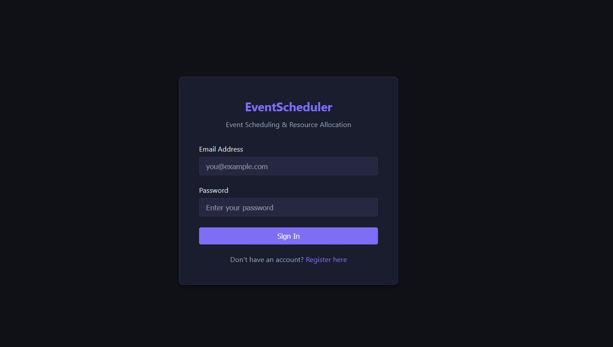
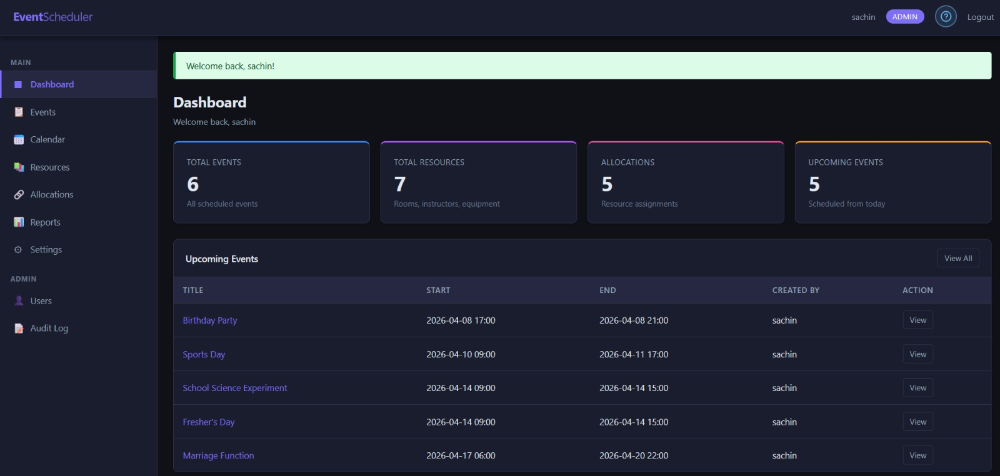
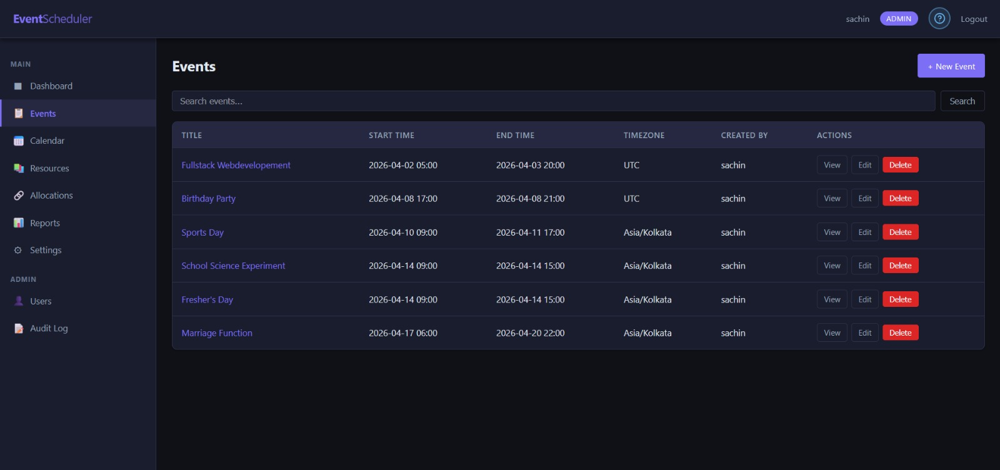
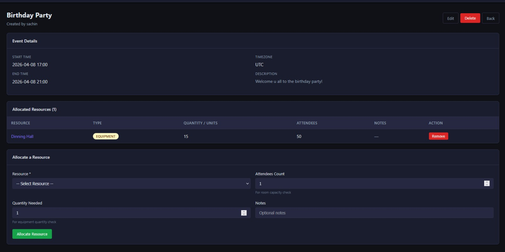
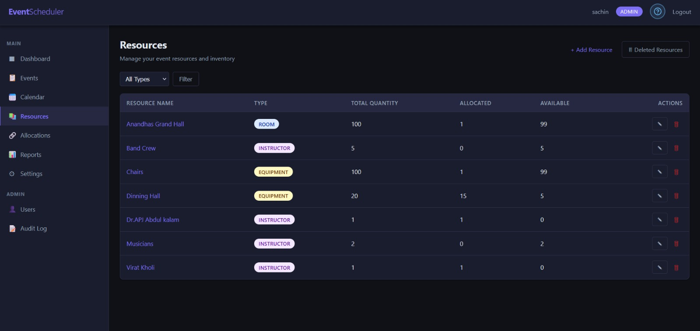
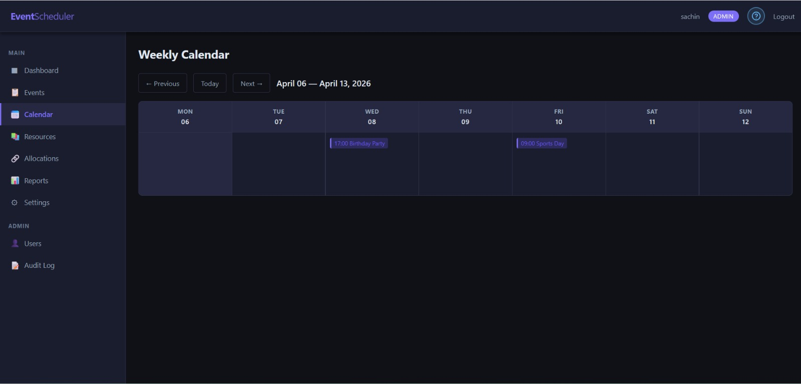
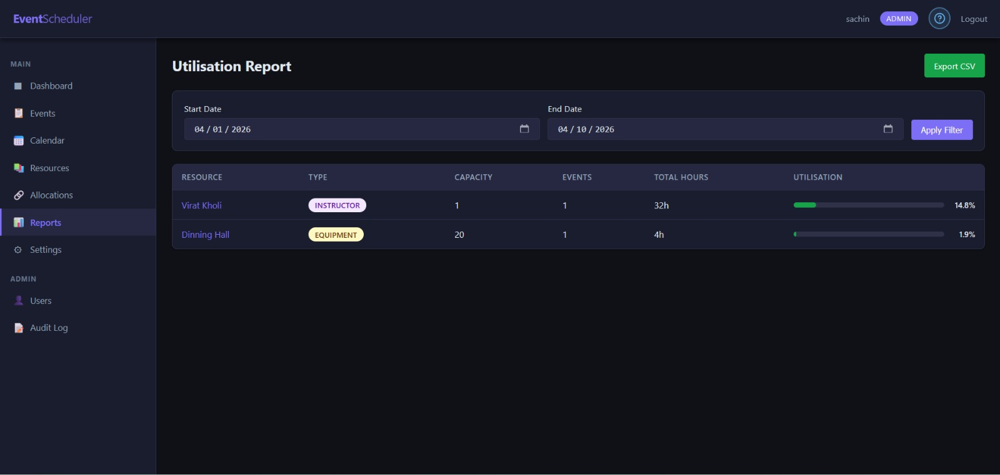
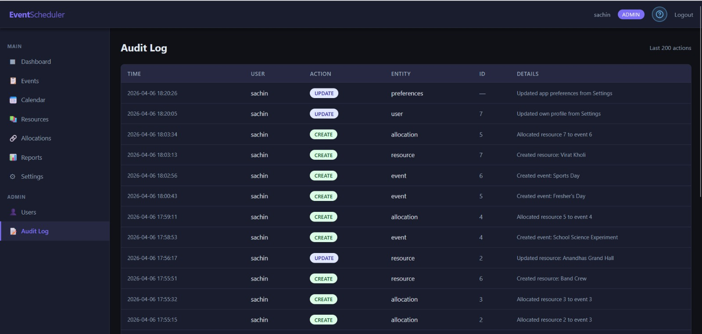
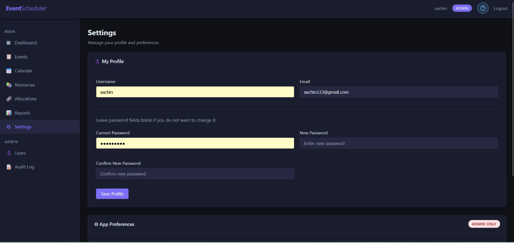

# 🗓️ Event Scheduling & Resource Allocation System

A full-featured **Event Scheduling and Resource Allocation** web application built with **Python/Flask** and **MySQL**. The system supports multi-role user management, event CRUD, resource tracking with real-time availability, an intelligent **conflict-detection engine**, weekly calendar views, utilisation reports with CSV export, and a complete REST API — all wrapped in a modern, dark-themed UI.
---

[Watch the Demo Video of the Event Scheduling System](https://drive.google.com/file/d/154w41FlCGjsuzQDUIkQSH6DgRGflfgLw/view?usp=drive_link)

## 📑 Table of Contents

* [Features](#-features)
* [Tech Stack](#-tech-stack)
* [Screenshots](#-screenshots)
* [Getting Started](#-getting-started)
* [Environment Variables](#-environment-variables)
* [Database Schema](#-database-schema)
* [Project Structure](#-project-structure)
* [REST API Reference](#-rest-api-reference)
* [Docker Deployment](#-docker-deployment)
* [Testing](#-testing)
* [License](#-license)

---

## ✨ Features

| Category                      | Details                                                              |
| ----------------------------- | -------------------------------------------------------------------- |
| **Authentication**            | Register, Login, Logout with secure password hashing (Werkzeug)      |
| **Role-Based Access**         | Three roles — `admin`, `organizer`, `viewer` — with route protection |
| **User Management**           | Admin panel to manage users                                          |
| **Event Management**          | CRUD for events with search & soft-delete                            |
| **Resource Management**       | Manage rooms, instructors, equipment                                 |
| **Resource Allocation**       | Allocate resources with validation                                   |
| **Conflict Detection Engine** | Detect time overlaps & capacity issues                               |
| **Calendar View**             | Weekly calendar navigation                                           |
| **Utilisation Reports**       | CSV export supported                                                 |
| **Audit Logs**                | Track all actions                                                    |
| **REST API**                  | Full JSON API                                                        |
| **Docker Support**            | Dockerfile + docker-compose                                          |
| **Error Handling**            | Custom 404 / 403 pages                                               |

---

## 🛠️ Tech Stack

| Layer     | Technology               |
| --------- | ------------------------ |
| Backend   | Python, Flask            |
| Database  | MySQL                    |
| Frontend  | HTML, CSS, Jinja2        |
| Auth      | Flask sessions, Werkzeug |
| Container | Docker                   |

---

## 📸 Screenshots

| Page         | Screenshot                                     |
| ------------ | ---------------------------------------------- |
| Login        |                |
| Dashboard    |        |
| Events       |              |
| Event Detail |  |
| Resources    |        |
| Calendar     |          |
| Report       |             |
| Audit Logs   |           |
| Settings     |          |

---

## 🚀 Getting Started

### Prerequisites

* Python 3.x
* MySQL
* pip

### Installation

```bash
git clone https://github.com/Sachin1043/event-scheduling-system.git
cd event-scheduling-system

python -m venv venv
venv\Scripts\activate

pip install -r requirements.txt
```

---

## ⚙️ Environment Variables

Create `.env`:

```
DB_HOST=localhost
DB_USER=root
DB_PASSWORD=your_password
DB_NAME=event_scheduler
SECRET_KEY=your_secret_key
```

---

## 🗄️ Database

Create DB:

```sql
CREATE DATABASE event_scheduler;
```

(Use your schema from project)

---

## ▶️ Run App

```bash
python app.py
```

👉 Open: http://localhost:5000

---

## 🐳 Docker

```bash
docker-compose up --build
```

---

## 🧪 Testing

```bash
python -m unittest
```

---

## 🔒 Default Admin

| Email                                         | Password |
| --------------------------------------------- | -------- |
| [admin@example.com](mailto:admin@example.com) | admin123 |

---

## 📄 License

This project is created for learning & assignment purposes.

---

<p align="center">
Built with ❤️ using Flask & MySQL
</p>
